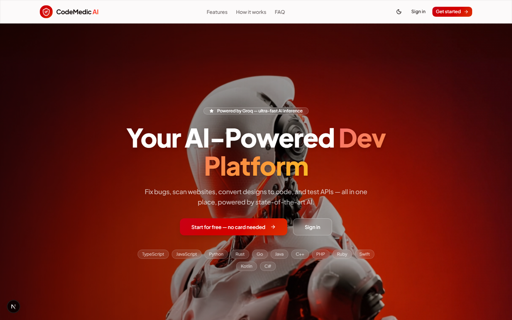
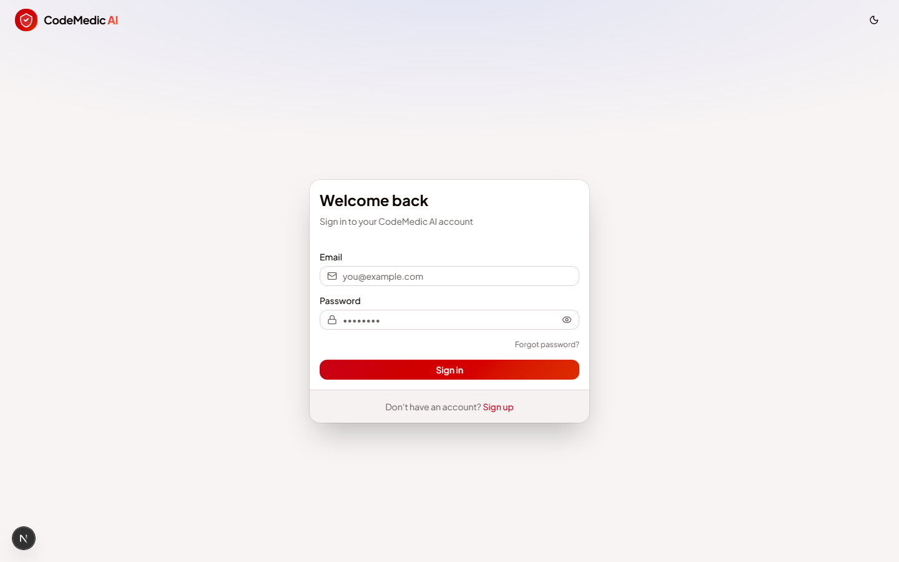
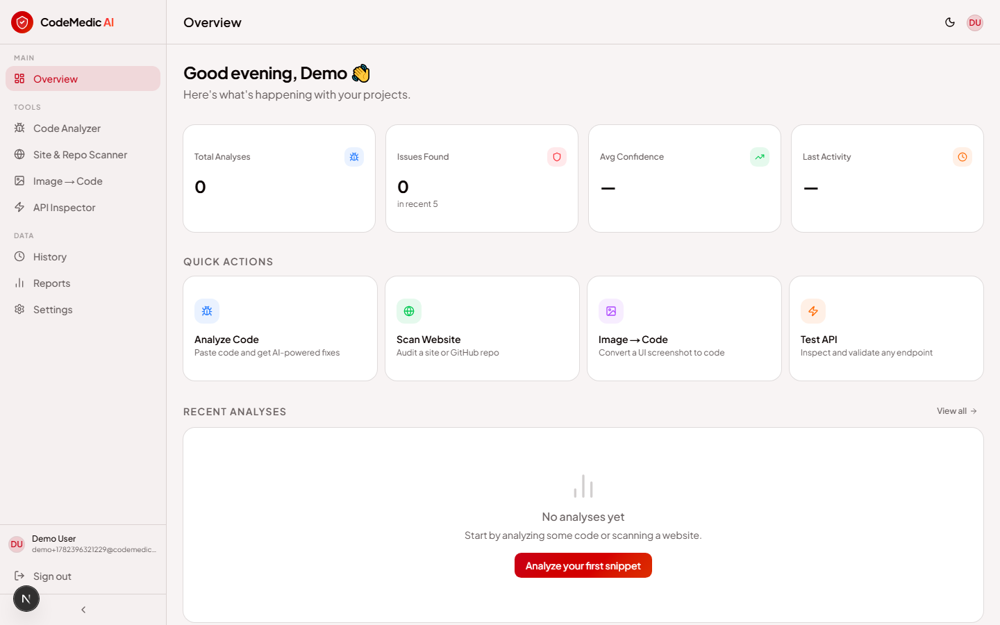
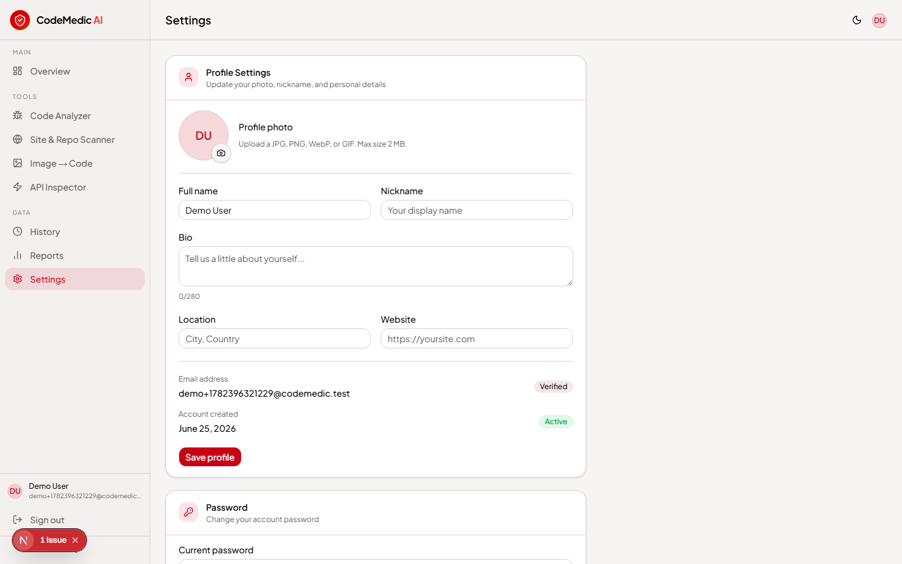

# CodeMedic AI

**AI-powered code diagnostics, security scanning, and developer tools — all in one dashboard.**

CodeMedic AI helps developers analyze broken code, audit websites and GitHub repos, convert UI screenshots to code, inspect APIs, and track results over time. It is built with **Next.js 16**, **Supabase Auth**, and **Groq (Llama 3.3 70B)** for fast, high-quality AI responses.

**Live demo:** [codemedic-ai.vercel.app](https://codemedic-ai.vercel.app)

**Repository:** [github.com/chunilalavology-debug/codemedic-ai](https://github.com/chunilalavology-debug/codemedic-ai)

---

## Screenshots

### Home Page (Landing)

The public landing page introduces the product, features, pricing FAQ, and sign-up flow.



### Login

Secure email/password authentication powered by Supabase.



### Dashboard — Overview

After signing in, users land on the Overview dashboard with stats, quick actions, and recent analyses.



### Dashboard — Profile Settings

Users can update profile photo, nickname, bio, password, and appearance settings.



---

## What Is This Project?

CodeMedic AI is a full-stack web application that acts as an **AI assistant for developers**. Instead of switching between multiple tools, you get:

- A **code fix engine** for bugs and stack traces
- A **website & repo scanner** for SEO, security, and performance
- An **image-to-code converter** for UI mockups
- An **API inspector** for testing HTTP endpoints
- **History & reports** to track everything you run

Every tool shares the same account, dashboard, and AI backend — so your workflow stays in one place.

---

## Core Features (Detailed)

### 1. AI Code Analyzer (`/analyze`)

Paste code or upload a file and get instant AI analysis.

| Capability | Details |
|------------|---------|
| **Analysis modes** | Full Scan, Errors only, Security, Performance |
| **Languages** | Auto-detect + TypeScript, JavaScript, Python, Rust, Go, Java, C++, C#, PHP, Ruby, Swift, Kotlin |
| **Input methods** | Paste code, upload file, optional error/stack trace |
| **Output** | Root cause, explanation, fixed code, side-by-side diff |
| **Issue breakdown** | Errors, security issues, performance issues with severity badges |
| **Actions** | Copy fixed code, syntax-highlighted results |
| **History** | Results saved automatically to your account |

**Use case:** You have a failing function or a stack trace — paste it in, pick an analysis type, and get a fix with explanation in seconds.

---

### 2. Site & Repo Scanner (`/scan`)

Audit live websites or public GitHub repositories.

| Capability | Details |
|------------|---------|
| **Website mode** | Enter any public URL — fetches HTML and analyzes structure |
| **GitHub mode** | Paste a repo URL — pulls metadata via GitHub API |
| **SEO checks** | Title, meta description, headings, alt tags, canonical URLs |
| **Security checks** | Missing headers, mixed content, exposed patterns |
| **Accessibility** | Basic a11y issue detection |
| **Performance** | Page weight, load hints, score breakdown |
| **Scores** | Overall, SEO, Security, Performance, Accessibility (0–100) |
| **Report** | Expandable issue list with severity, location, and recommendations |
| **Export** | Copy full scan report to clipboard |

**Use case:** Before launching a site or open-sourcing a repo, run a scan to catch SEO gaps and security issues early.

---

### 3. Image → Code (`/image-to-code`)

Upload a UI screenshot and generate production-ready code.

| Capability | Details |
|------------|---------|
| **Input** | JPG, PNG, WebP, GIF (max 5 MB) |
| **Frameworks** | HTML, React, Next.js, Vue, Tailwind |
| **Modes** | Component or full page |
| **Output** | Generated code with syntax highlighting |
| **Actions** | Copy code, download as file |
| **AI model** | Llama 4 Scout (vision) via Groq |

**Use case:** Turn a Figma export or screenshot into a starting point for React/Next.js components.

---

### 4. API Inspector (`/api-inspector`)

Test HTTP endpoints through a secure server-side proxy.

| Capability | Details |
|------------|---------|
| **Methods** | GET, POST, PUT, PATCH, DELETE, HEAD, OPTIONS |
| **Auth** | None, Bearer token, Basic auth |
| **Custom headers** | Add/remove request headers |
| **Request body** | JSON or plain text body support |
| **Response view** | Status, latency, headers, body (pretty-print JSON) |
| **Issue detection** | Slow responses, missing security headers, server errors |
| **Code export** | Auto-generated curl, fetch, and axios snippets |

**Use case:** Debug a REST API, inspect response headers, and copy ready-to-use code snippets.

---

### 5. Analysis History (`/history`)

View and manage all past code analyses.

| Capability | Details |
|------------|---------|
| **List view** | All saved analyses with title, language, type, date |
| **Expand** | View full results inline |
| **Delete** | Remove individual records |
| **Pagination** | Load more as your history grows |
| **Privacy** | Row-level security — you only see your own data |

---

### 6. Reports (`/reports`)

Visual analytics for your analysis activity.

| Capability | Details |
|------------|---------|
| **Summary stats** | Total analyses, issues found, languages used |
| **Charts** | Activity over time, language breakdown, analysis types |
| **Timeline** | Recent activity feed |

---

### 7. Overview Dashboard (`/overview`)

Your home base after login.

| Capability | Details |
|------------|---------|
| **Welcome** | Personalized greeting using your profile name |
| **Stats cards** | Total analyses, issues detected, security findings |
| **Quick actions** | One-click links to all major tools |
| **Recent analyses** | Last 5 saved results at a glance |

---

### 8. Profile & Settings (`/settings`)

Manage your account and preferences.

| Section | Details |
|---------|---------|
| **Profile photo** | Upload avatar (JPG/PNG/WebP/GIF, max 2 MB) stored in Supabase Storage |
| **Full name** | Your display name |
| **Nickname** | Short name shown in header and sidebar |
| **Bio** | Short about text (280 characters) |
| **Location** | City, country, etc. |
| **Website** | Personal or portfolio URL |
| **Password** | Change password with current + new password verification |
| **Appearance** | Light, Dark, or System theme |
| **Sign out** | Log out and return to home page |

**Profile menu (header):** Click your avatar to see email, open Profile Settings, or log out.

---

### 9. Authentication

| Feature | Route | Details |
|---------|-------|---------|
| Sign up | `/signup` | Email + password with name |
| Sign in | `/login` | Email/password login |
| Forgot password | `/forgot-password` | Email reset link |
| Update password | `/update-password` | Set new password after reset |
| Protected routes | Dashboard | Middleware redirects unauthenticated users to login |
| Session | Supabase SSR | Cookie-based auth with server-side validation |

---

## Tech Stack

| Layer | Technology |
|-------|------------|
| **Framework** | Next.js 16 (App Router, Turbopack) |
| **Language** | TypeScript |
| **UI** | React 19, Tailwind CSS 4, shadcn/ui, Base UI |
| **Auth & Database** | Supabase (Auth, PostgreSQL, Storage, RLS) |
| **AI** | Groq SDK — Llama 3.3 70B (text), Llama 4 Scout (vision) |
| **Charts** | Recharts |
| **Animations** | Framer Motion |
| **Testing** | Vitest, Testing Library |
| **Deployment** | Vercel |

---

## Project Structure

```
codemedic-ai/
├── app/
│   ├── (auth)/          # Login, signup, forgot/update password
│   ├── (dashboard)/     # Protected dashboard pages
│   ├── api/             # API routes (analyze, scan, history, etc.)
│   ├── auth/callback/   # Supabase OAuth / email callback
│   └── page.tsx         # Public landing page
├── components/
│   ├── analyze/         # Code analyzer UI
│   ├── scan/            # Site & repo scanner UI
│   ├── image-to-code/   # Vision-to-code UI
│   ├── api-inspector/   # API testing UI
│   ├── history/         # History list UI
│   ├── reports/         # Reports & charts UI
│   ├── overview/        # Dashboard overview UI
│   ├── settings/        # Profile & settings UI
│   └── layout/          # Header, sidebar, shared layout
├── lib/
│   ├── auth/            # Sign out, profile actions, API auth
│   ├── supabase/        # Supabase client, server, middleware
│   ├── claude.ts        # Groq AI analysis engine
│   └── history.ts       # Analysis persistence helpers
├── supabase/
│   └── schema.sql       # Database tables, RLS, avatar storage
├── public/docs/         # README screenshots
└── __tests__/           # Unit tests
```

---

## Getting Started

### Prerequisites

- **Node.js** 18+ (20 recommended)
- **npm** or yarn
- **Supabase** project ([supabase.com](https://supabase.com))
- **Groq API key** ([console.groq.com](https://console.groq.com)) — free tier available

### 1. Clone the repository

```bash
git clone https://github.com/chunilalavology-debug/codemedic-ai.git
cd codemedic-ai
```

### 2. Install dependencies

```bash
npm install
```

### 3. Configure environment variables

Copy the example file and fill in your keys:

```bash
cp .env.example .env.local
```

| Variable | Description |
|----------|-------------|
| `NEXT_PUBLIC_SUPABASE_URL` | Supabase project URL |
| `NEXT_PUBLIC_SUPABASE_ANON_KEY` | Supabase anon/public key |
| `GROQ_API_KEY` | Groq API key for AI features |
| `NEXT_PUBLIC_APP_URL` | App URL (`http://localhost:3000` locally) |

### 4. Set up Supabase database

Run the SQL in `supabase/schema.sql` inside the Supabase SQL Editor. This creates:

- `analyses` table with row-level security
- `avatars` storage bucket for profile photos

### 5. Run the development server

```bash
npm run dev
```

Open [http://localhost:3000](http://localhost:3000) in your browser.

---

## Available Scripts

| Command | Description |
|---------|-------------|
| `npm run dev` | Start development server |
| `npm run build` | Production build |
| `npm run start` | Start production server |
| `npm run lint` | Run ESLint |
| `npm run type-check` | TypeScript type checking |
| `npm run test` | Run Vitest unit tests |
| `npm run test:watch` | Run tests in watch mode |

---

## API Routes

All sensitive API routes require authentication.

| Route | Method | Description |
|-------|--------|-------------|
| `/api/analyze` | POST | Run AI code analysis |
| `/api/scan` | POST | Scan website or GitHub repo |
| `/api/image-to-code` | POST | Generate code from image |
| `/api/test-endpoint` | POST | Proxy HTTP API test |
| `/api/history` | GET, DELETE | List or delete analysis history |
| `/api/profile/avatar` | POST | Upload profile photo |
| `/api/upload` | POST | Upload code files for analysis |

---

## Security

- Dashboard and API routes are protected by Supabase authentication
- Row-level security (RLS) ensures users only access their own data
- SSRF protection on scan and API inspector routes (blocks internal/private URLs)
- Safe redirect validation on auth callback
- Server-side session handling via `@supabase/ssr`

---

## Deployment

Deploy to [Vercel](https://vercel.com) (recommended):

1. Push to GitHub
2. Import project in Vercel
3. Add environment variables from `.env.example`
4. Run `supabase/schema.sql` in your Supabase project
5. Deploy

Set `NEXT_PUBLIC_APP_URL` to your production domain (e.g. `https://codemedic-ai.vercel.app`).

---

## Author

Built by **Shashi Thakur**

---

## License

This project is private. All rights reserved.
